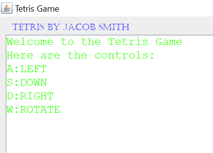
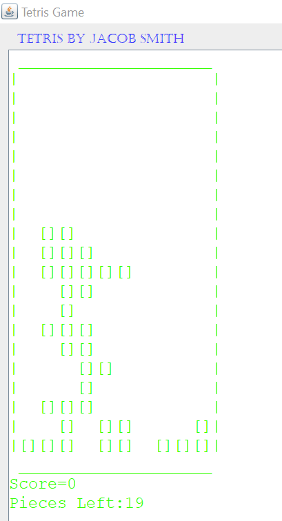
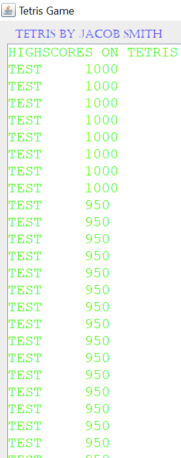

Tetris Project
==============
+ This project simulates a game of tetris using the [swing](https://docs.oracle.com/javase/tutorial/uiswing/index.html) library in java
+ A game is played by running the main method of the GUI Client class
	+ Then the controls are displayed
	+ 
	+ The game is played
	+ 
	+ And the high scores are displayed
	+ 
+ Written by Jacob Smith
	+ jsmith2021@brandeis.edu